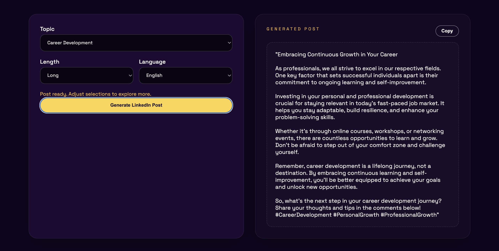

# project-genai-post-generator
This tool will analyze posts of a LinkedIn influencer and help them create the new posts based on the writing style in their old posts  



Let's say Mohan is a LinkedIn influencer and he needs help in writing his future posts. He can feed his past LinkedIn posts to this tool and it will extract key topics. Then he can select the topic, length, language etc. and use Generate button to create a new post that will match his writing style. 

## Technical Architecture


1. Stage 1: Collect LinkedIn posts and extract Topic, Language, Length etc. from it.
1. Stage 2: Now use topic, language and length to generate a new post. Some of the past posts related to that specific topic, language and length will be used for few shot learning to guide the LLM about the writing style etc.

## Set-up
1. Grab an API key from https://console.groq.com/keys. Inside `.env` update `GROQ_API_KEY` with the key you created. (Optional) set `GROQ_MODEL` to a currently supported Groq model such as `llama-3.1-8b-instant` (check https://console.groq.com/docs/deprecations for current names).
2. Install dependencies:
    ```commandline
    pip install -r requirements.txt
    ```
3. Start the Flask web app:
    ```commandline
    python main.py
    ```
4. Visit `http://127.0.0.1:5000` to use the PerLink experience. Select a topic, length, and language, then hit **Generate LinkedIn Post**. A contact section is built into the page for quick outreach.
Copyright (C) Codebasics Inc. All rights reserved.


**Additional Terms:**
This software is licensed under the MIT License. However, commercial use of this software is strictly prohibited without prior written permission from the author. Attribution must be given in all copies or substantial portions of the software.
